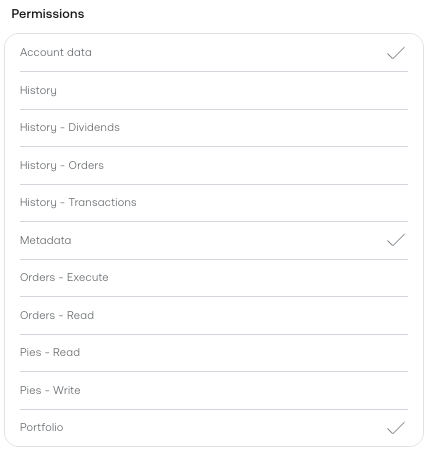

# 📈 ISA AI Analyst

> **Capital preservation is the primary directive.**

ISA AI Analyst is an autonomous, AI-powered **investment analyst** built specifically for **UK Tax-Free ISA accounts**. Think of it as a helpful data assistant that works quietly in the background — analysing your portfolio every day, screening financial news for risk, and delivering clear, data-driven insights directly to your Telegram so you can make better-informed investment decisions without spending hours researching.

The bot is designed to address two of the biggest challenges for retail investors: **emotional decision-making** (panic-selling on bad news, chasing momentum) and **information overload** (not having time to read the news on every stock you hold). ISA AI Analyst handles both, so you only act when the data says it makes sense to.

Powered by the [OpenClaw](https://openclaw.ai) framework, it runs entirely on your own machine inside a secure Docker container.

[](LICENSE)
[](https://www.apple.com/macos/)
[](https://www.docker.com/products/docker-desktop/)
[](https://www.docker.com/products/docker-desktop/)
[](https://telegram.org/)

---

## 📊 Example Report

*This is what lands in your Telegram twice a day:*

<!-- SCREENSHOT: Example Telegram report output showing portfolio analysis, trade suggestions, and news risk summary -->


---

## 🧠 Investment Strategy

ISA AI Analyst applies two well-established, conservative investment strategies automatically on every report.

### The 3 Safety Gates

Before issuing any BUY recommendation, the analyst requires a stock to pass **three independent checks** simultaneously. If any gate fails, no action is recommended — regardless of how attractive the price looks.

| Gate | Check | Why It Matters |
|---|---|---|
| **Trend** | Current price must be above the Simple Moving Average (SMA) | Avoids buying into a confirmed downtrend |
| **Volatility** | Daily volatility must be strictly under 5% | Avoids entering during high-turbulence periods where price swings are driven by noise rather than fundamentals |
| **News** | AI scans recent headlines and blocks entry if severe fundamental risks are detected (fraud, lawsuits, profit warnings, regulatory action) | Protects against value traps — stocks that look cheap on price but are deteriorating fundamentally |

All three gates must be green simultaneously. One red gate = no recommendation.

### Dollar-Cost Averaging (DCA)

Rather than deploying capital in a single lump sum, ISA AI Analyst scales into positions gradually up to a configurable **daily DCA limit** (e.g. £500/day). This smooths out the impact of short-term price volatility and removes the pressure of trying to time the perfect entry point.

---

## 📋 Table of Contents

- [How It Works](#-how-it-works)
- [Core Features](#️-core-features)
- [Security & Protection](#️-built-in-security--protection-layers)
- [Prerequisites](#️-prerequisites)
- [Quick Start](#-quick-start)
  - [A. Clone the Repository](#a-clone-the-repository)
  - [B. Create Your Accounts](#b-create-your-accounts--gather-api-keys)
  - [C. Run the Setup TUI](#c-run-the-setup-tui)
  - [D. Pair Your Telegram Bot](#d-pair-your-telegram-bot)
  - [E. Talk to Your Analyst](#e-talk-to-your-analyst)
- [Portfolio Config Reference](#-portfolio-config-reference)
- [Environment Variable Reference](#-environment-variable-reference)
- [Updating & Maintenance](#-updating--maintenance)
- [Troubleshooting](#-troubleshooting)
- [License](#-license)
- [Disclaimer](#️-disclaimer)
- [Support the Project](#-good-luck--support-the-project)

---

## 🔍 How It Works

At each scheduled report (default: 08:30 & 16:00 UK time), ISA AI Analyst:

1. **Reads your portfolio targets** — the stocks you want to hold and at what allocations
2. **Fetches live market data** from EODHD for every stock in your watchlist
3. **Applies the 3 Safety Gates** — trend, volatility, and news checks for each holding
4. **Compares your current holdings** via the Trading 212 read-only API against your targets
5. **Generates a Markdown report** and pushes it to your Telegram with analyst commentary

You can also chat with the analyst at any time in plain English to update your portfolio, change your schedule, or trigger an immediate report.

---

## ⚙️ Core Features

| Feature | Description |
|---|---|
| 🤖 **100% Autonomous** | Runs automatically at configurable times (default: 08:30 & 16:00 UK time) |
| 🛡️ **3-Gate Safety Filter** | Every BUY signal must pass trend, volatility, and AI news checks before being recommended |
| 📉 **DCA Engine** | Scales into positions gradually up to a daily limit — no lump-sum exposure |
| 📰 **AI News Risk Manager** | Scans daily headlines and blocks recommendations if severe fundamental risks are detected |
| 🔒 **Fail-Secure Architecture** | If the market is closed or an API goes down, the analyst safely skips execution |
| 📱 **Telegram Integration** | Actionable Markdown reports pushed straight to your phone |
| 💬 **Natural Language Control** | Chat to update your portfolio, adjust allocations, or change your schedule |
| 🔎 **Auto Ticker Resolution** | Tell the bot a stock name — it resolves the correct T212 and EODHD ticker symbols automatically |

---

## 🛡️ Built-In Security & Protection Layers

- **Isolated & Containerised:** Runs entirely inside a Docker container, completely separated from your host OS. It can only access files within the project folder you explicitly mounted.†
- **No Direct Trade Execution:** The analyst never has access to your trading account password. It uses read-only API permissions and can only provide recommendations — it cannot place trades.
- **Cost-Capped AI:** Usage is restricted to your available API credits. Set hard billing limits in your OpenRouter account to prevent unexpected charges.
- **Minimised Prompt Injection Risk:** The analyst does not browse arbitrary web pages. It exclusively consumes structured financial data from EODHD, significantly reducing the risk of prompt injection attacks via maliciously crafted web content.
- **Zero-Trust Telegram Pairing:** The bot ignores all Telegram messages until a one-time pairing code is explicitly approved — preventing anyone who discovers your bot username from issuing commands to it.

---

## 🛠️ Prerequisites

> **Platform support:** macOS and Windows (via Docker Desktop + WSL2).

You only need two things installed before starting:

1. **[Docker Desktop](https://www.docker.com/products/docker-desktop/)** — runs the analyst in its secure container
2. **[Telegram](https://telegram.org/)** — download on your phone (and desktop if you prefer) to receive reports and chat with the analyst

That's it. The `setup.sh` script handles all configuration — no code editor required.

---

## 🚀 Quick Start

### A. Clone the Repository

Open **Terminal** (macOS) or **PowerShell** (Windows) and run:

```bash
git clone https://github.com/ClementHa/isa-ai-analyst.git
cd isa-ai-analyst
```

> **Windows users:** Install [Git for Windows](https://git-scm.com/download/win) and [Docker Desktop for Windows](https://docs.docker.com/desktop/setup/install/windows-install/) (requires WSL2) first. All subsequent commands are identical.

---

### B. Create Your Accounts & Gather API Keys

You will need accounts with three services. Work through them in order — have each account's API key ready before moving to the Setup TUI in Step C.

> *Note: Some links below are affiliate links. Using them helps support the continued open-source development of ISA AI Analyst at no extra cost to you.*

---

#### 🧠 OpenRouter — AI Provider (the Analyst's Brain)

OpenRouter gives you access to many AI models through a single API, including powerful free-tier options.

1. Sign up at **[openrouter.ai](https://openrouter.ai)** and verify your email
2. Go to **Keys** and click **Create Key** — name it `ISA AI Analyst`
3. Copy the generated key — you will paste it into the Setup TUI shortly

<!-- SCREENSHOT: OpenRouter dashboard showing the Keys page with Create Key button highlighted -->


> ℹ️ **Free tier:** Adding **$5–$10** to your account unlocks 1,000 free-model requests per day and gives you access to capable models at effectively zero cost for this use case. Set a **spending limit** in Billing to cap any possible charges.

---

#### 🏦 Trading 212 — Your ISA Broker

1. Sign up using the affiliate link: **[Create Trading 212 Account](https://www.trading212.com/invite/4DtCF9r91Ms)**
2. Select **Stocks ISA** as your account type and complete identity verification
3. Make a deposit of at least **£1**

   > ⚠️ **Required.** The API option does not appear until the account has been funded at least once.

4. Go to **Settings → API (Beta) → Generate API Key**

   > 🔒 **Critical — before you generate:**
   > When the permissions screen appears, you **MUST uncheck** these two options:
   > - ❌ **Orders — Execute**
   > - ❌ **Pies — Write**
   >
   > ISA AI Analyst only reads your portfolio. Leaving these enabled means a compromised key could place real trades on your account.

<!-- SCREENSHOT: Trading 212 API permissions screen with Orders-Execute and Pies-Write unchecked -->


5. Copy both the **Key ID** and **Secret Key** immediately — the Secret is shown only once.

---

#### 📊 EODHD — Market Data & Financial News

1. Sign up using the affiliate link: **[Create EODHD Account](https://eodhd.com?via=clementha)**
2. Once logged in, go to your **Dashboard** — your API token is shown at the top
3. Copy the token

<!-- SCREENSHOT: EODHD dashboard showing the API token field highlighted at the top -->


> ℹ️ **Free tier:** 20 API calls/day — sufficient for a small portfolio with twice-daily reports. Upgrade if you track many stocks or increase report frequency.

---

#### 💬 Telegram — Your Reporting Interface

1. Open Telegram and search for **@BotFather**
2. Send `/newbot`, follow the prompts, and copy the **Bot Token**
3. Search for **@userinfobot**, send `/start`, and copy your **Chat ID**

---

### C. Run the Setup TUI

Make sure **Docker Desktop is open and running**, then launch the interactive setup menu:

```bash
bash setup.sh
```

You will see this interface:

```
=================================================
🤖 ISA AI ANALYST - SETUP
=================================================
Status: 🔴 STOPPED / NOT INSTALLED
-------------------------------------------------
 SETUP CHECKLIST:
 1) [ ] 🧠 Set AI API Key (OpenRouter)
 2) [ ] 💰 Set Broker API Keys (Trading 212)
 3) [ ] 👁️ Set Market Data API Key (EODHD)
 4) [ ] 💬 Set Telegram API Keys
 5) [ ] 🛠️ Run Initial Setup  (Complete keys first)
-------------------------------------------------
 CONTROLS:
 6) 🚀 Start Agent            (Run Setup first)
 7) 🛑 Stop Agent             (Run Setup first)
 8) 📋 View Live Logs         (Run Setup first)
 9) 🔑 Approve Telegram Pairing (Agent must be running)
 0) ❌ Exit
=================================================
Enter choice [0-9]:
```

Work through options **1 → 2 → 3 → 4** in order, pasting in your API keys when prompted. The checklist updates in real time as each key is saved. Once all four are ticked, option **5 (Run Initial Setup)** becomes available — select it to boot the Docker container and configure the analyst engine automatically.

Once complete, the menu updates to show all items ticked and the agent running:

```
=================================================
🤖 ISA AI ANALYST - SETUP
=================================================
Status: 🟢 RUNNING
-------------------------------------------------
 SETUP CHECKLIST:
 1) [✓] 🧠 Set AI API Key (OpenRouter)
 2) [✓] 💰 Set Broker API Keys (Trading 212)
 3) [✓] 👁️ Set Market Data API Key (EODHD)
 4) [✓] 💬 Set Telegram API Keys
 5) [✓] 🛠️ Run Initial Setup
-------------------------------------------------
 CONTROLS:
 6) 🚀 Start Agent
 7) 🛑 Stop Agent
 8) 📋 View Live Logs
 9) 🔑 Approve Telegram Pairing
 0) ❌ Exit
=================================================
Enter choice [0-9]:
```

> 💡 You can return to `bash setup.sh` at any time to start, stop, view logs, or update your API keys.

---

### D. Pair Your Telegram Bot

The analyst uses a zero-trust pairing system — it ignores all messages until you explicitly approve a one-time code. This prevents anyone who finds your bot's username from issuing commands to it.

1. Open Telegram and search for your bot by the username you created with @BotFather
2. Send any message — `hello` is fine
3. The bot replies with a pairing code, for example:
   ```
   Your pairing code is: Z2EDQKMK
   Approve this code to continue.
   ```
4. Go back to the Setup TUI, select option **9 (Approve Telegram Pairing)**, and paste the code when prompted

The bot confirms the connection and is ready.

> ⚠️ You may need to repeat this step if you fully restart the container. See [Troubleshooting](#-troubleshooting) if the pairing code is never accepted.

---

### E. Talk to Your Analyst

Open Telegram and message your bot. Some useful prompts to get started:

| Message | Action |
|---|---|
| `Run it now.` | Triggers an immediate portfolio analysis and report |
| `Add Scottish Mortgage at 25%` | Resolves tickers automatically and adds to your portfolio |
| `Show my portfolio` | Displays current allocations and unallocated percentage |
| `What is my current schedule?` | Shows the configured report times |
| `Set my DCA limit to £300` | Updates your daily DCA cap |
| `Pause reporting.` | Suspends automatic daily reports |

---

### 🎉 Setup Complete — You're All Set!

Congratulations — ISA AI Analyst is now fully up and running. Here's what you have:

- ✅ A securely containerised AI analyst running entirely on your own machine
- ✅ Read-only Trading 212 integration — no accidental trades are possible
- ✅ Twice-daily portfolio analysis with 3-gate safety filtering and DCA logic
- ✅ AI-powered financial news risk screening before every recommendation
- ✅ Full natural language portfolio management via Telegram

Your first scheduled report arrives at the next run time (default: 08:30 or 16:00 UK). Can't wait? Send **`Run it now.`** on Telegram for an immediate report.

If you find ISA AI Analyst useful, please consider [⭐ starring the repository](https://github.com/ClementHa/isa-ai-analyst) — it helps others discover the project and keeps development going.

---

## 🍀 Good Luck & Support the Project

Investing is part discipline, part patience — and a little bit of luck never hurts. We hope ISA AI Analyst helps you make more informed, confident decisions with your ISA.

If the analyst has ever kept you from a bad trade, flagged a risk you missed, or simply saved you time — consider buying us a coffee. Every contribution goes directly towards new features, better models, and keeping the project open-source and free.

[](https://ko-fi.com/clementha)

> *"The stock market is a device for transferring money from the impatient to the patient."* — Warren Buffett

Good luck out there. 📈

---

## 📊 Portfolio Config Reference

You do not need to edit this file manually. The analyst manages it for you via Telegram chat. It is documented here for reference.

| Field | Type | Description |
|---|---|---|
| `isa_allowance_target` | `number` | Total ISA allowance for the tax year in GBP (e.g. `20000`) |
| `target_cash_pct` | `number` | Fraction of portfolio to keep as cash reserve (e.g. `0.25` = 25%) |
| `daily_dca_limit` | `number` | Maximum GBP to deploy per stock per day via DCA (e.g. `500`) |
| `holdings` | `object` | Map of T212 ticker keys to EODHD ticker, display name, and target weight |

**Example:**
```json
{
  "isa_allowance_target": 20000,
  "target_cash_pct": 0.25,
  "daily_dca_limit": 500,
  "holdings": {
    "VOD_LSE_EQ": {
      "eodhd_ticker": "VOD.LSE",
      "name": "Vodafone Group PLC",
      "target_weight": 0.25
    }
  }
}
```

> ℹ️ Ticker symbols are resolved automatically when you add a stock via Telegram. You never need to look them up manually.

---

## 🔑 Environment Variable Reference

All variables are set via the Setup TUI — this table is for reference only.

| Variable | Required | Description |
|---|---|---|
| `LLM_BASE_URL` | ✅ | OpenAI-compatible endpoint (set automatically to OpenRouter) |
| `LLM_MODEL` | ✅ | Model name (set automatically by setup) |
| `LLM_API_KEY` | ✅ | Your OpenRouter API key |
| `OPENROUTER_API_KEY` | ✅ | Same key — required by some OpenClaw internals |
| `EODHD_API_KEY` | ✅ | Your EODHD market data API key |
| `T212_KEY_ID` | ✅ | Your Trading 212 API Key ID |
| `T212_SECRET` | ✅ | Your Trading 212 API Secret |
| `TELEGRAM_BOT_TOKEN` | ✅ | Token from @BotFather |
| `TELEGRAM_CHAT_ID` | ✅ | Your personal chat ID from @userinfobot |

---

## 🔄 Updating & Maintenance

To pull the latest version and restart:

```bash
git pull origin main
docker compose down
docker compose up -d --build
```

To stop the analyst without removing configuration:

```bash
bash setup.sh   # Select option 7 — Stop Agent
```

Or directly:

```bash
docker compose stop
```

To completely remove all containers and free disk space:

```bash
docker compose down --volumes --rmi all
```

---

## 🩺 Troubleshooting

**Pairing code is never accepted**
- The container session state was likely lost on a restart
- Fix: `docker compose down` then `docker compose up -d`, then redo Step D from scratch

**Bot not responding on Telegram**
- Confirm Docker is running: `docker compose ps`
- Check logs via the Setup TUI (option 8) or `docker compose logs -f`
- Confirm you completed the pairing step — the bot silently ignores all messages until paired
- Verify `TELEGRAM_BOT_TOKEN` and `TELEGRAM_CHAT_ID` are correct (re-run option 4 in the TUI)

**"API Key invalid" error in logs**
- Re-run the relevant step in the Setup TUI and re-paste the key
- Check your EODHD subscription is active
- Confirm both `T212_KEY_ID` and `T212_SECRET` are filled — both are required
- If your T212 key stopped working, verify your ISA account still has funds

**Reports not arriving at scheduled times**
- Check your Docker host's system clock and timezone are correct
- Test immediately with `Run it now.` in Telegram

**Docker Desktop won't start on Apple Silicon**
- Install Rosetta 2: `softwareupdate --install-rosetta`

**Docker Desktop won't start on Windows**
- Run `wsl --install` in PowerShell (as Administrator), then restart
- Enable WSL2 integration: Docker Desktop → Settings → Resources → WSL Integration

---

## 📝 License

This project is open-source under the [MIT License](LICENSE).

---

## ⚠️ Disclaimer

This software is provided for **educational and informational purposes only**. It does not constitute financial advice. The AI can hallucinate, and market data APIs can return incorrect or delayed data. **Always verify recommendations manually before taking any action.** Never risk capital you cannot afford to lose. Past performance is not indicative of future results.

---

† No Docker container is a perfect security boundary. Containers share the host's network stack by default, meaning a severely compromised container could theoretically attempt to probe your host machine over the local Docker bridge network. ISA AI Analyst does not mount the Docker socket and does not run in privileged mode, which significantly limits the blast radius of any such attack. For the vast majority of users, the container isolation is more than sufficient — but it is not equivalent to a fully separate virtual machine.
